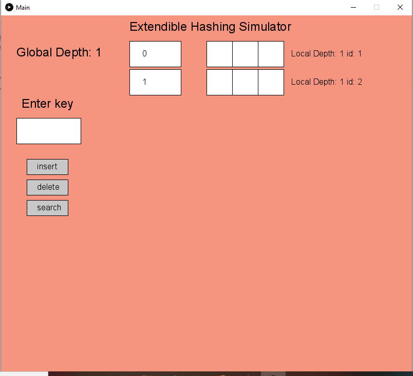
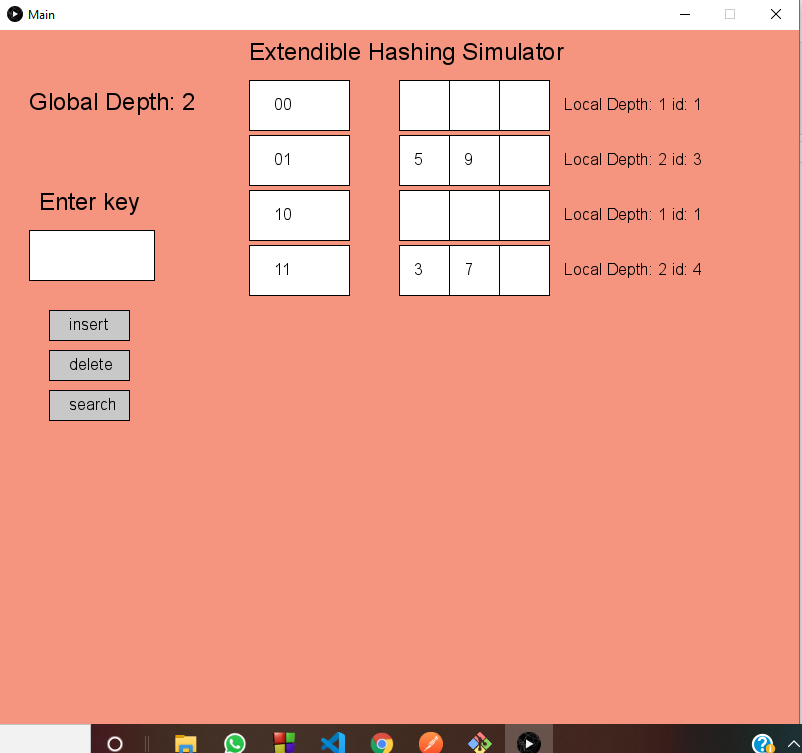

# Extendible hashing simulator

## Installation Instructions :-

1. Extract everything to same folder.
2. All the java and jar files have to be in the same folder.
3. To compile -
    * **For Linux**  
      javac -cp ".:core.jar" Main.java
    * **For Windows**  
      javac -cp ".;core.jar" Main.java
4. To Run -
    * **For linux**  
      java -cp ".:core.jar" Main
    * **For Windows**  
      java -cp ".;core.jar" Main 
  
A Gui window will open

## Screenshots of tthe simulator :-

